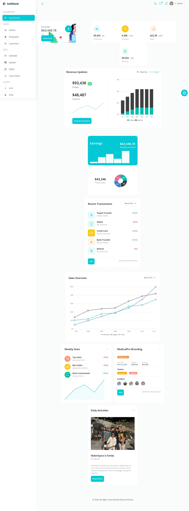
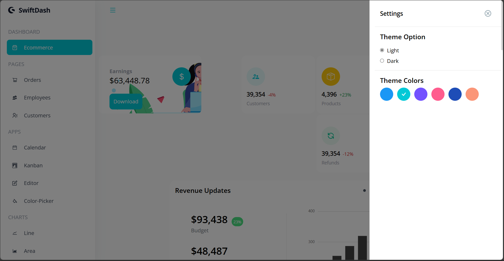
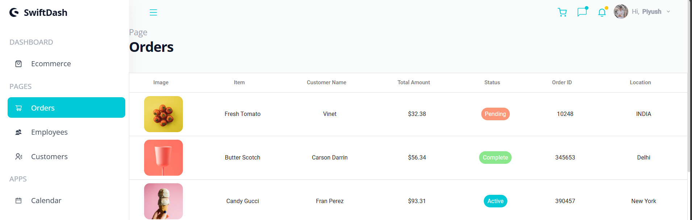
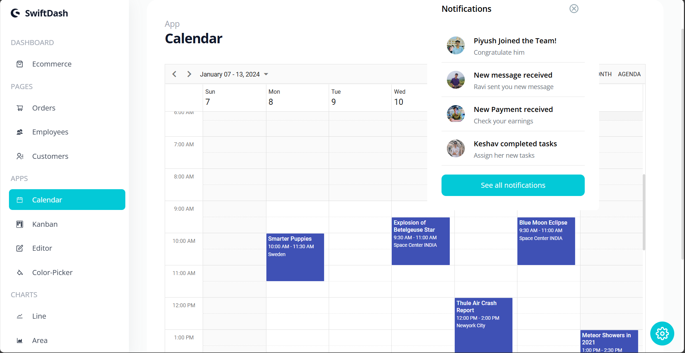

# React Admin Dashboard
## Live Demo

Check out the live demo of the project [https://swiftdash.netlify.app/](https://swiftdash.netlify.app/).



## Overview

This project is a feature-rich React Admin Dashboard application built using Syncfusion UI components. The application includes theming, tables, charts, calendar, Kanban board, and more. It provides a comprehensive platform for managing and visualizing data effectively.

## Features

- **Theming**: Customizable themes to personalize the look and feel of the dashboard.
 
  
- **Tables**: Interactive and sortable tables for data management.
   
- **Charts**: Various chart types for data visualization.
- **Calendar**: Integrated calendar for scheduling and planning.

- **Kanban Board**: Task management using a Kanban board.
- **Responsive Design**: Fully responsive layout to support various screen sizes.
- **User Authentication**: Secure login and user management.

## Getting Started

### Prerequisites

- Node.js and npm installed on your machine.

### Installation

 ```sh
   git clone https://github.com/Piyushsharma2004/SwiftDash.git

   ```
   ### Install dependencies:
 ```sh
  npm install

   ```
   ### Start the development server:
   ```sh
    npm start
   ```
### Syncfusion UI Components

This project leverages the powerful Syncfusion UI components library to provide a seamless and efficient user experience. Syncfusion offers a wide range of components that are easy to integrate and customize.

### Key Components Used:
- **Grid**: For displaying and managing tabular data.
- **Charts**: For creating interactive and customizable charts.
- **Scheduler** : For calendar and scheduling functionalities.
- **Kanban**: For task management and workflow visualization.
